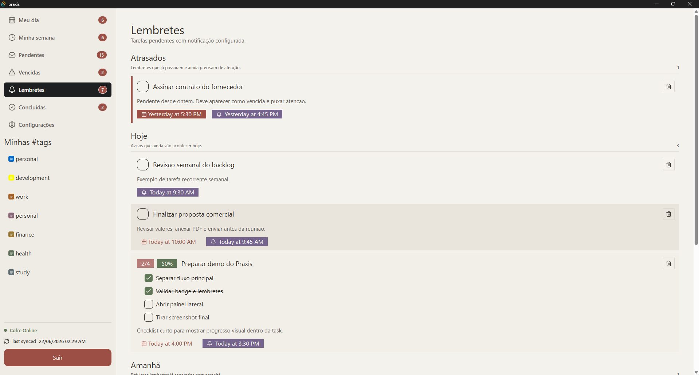
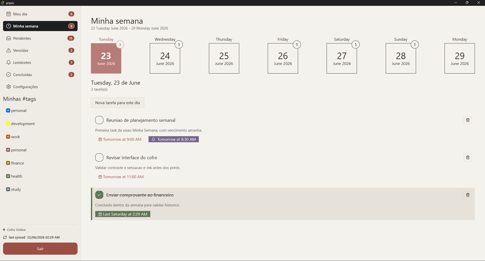
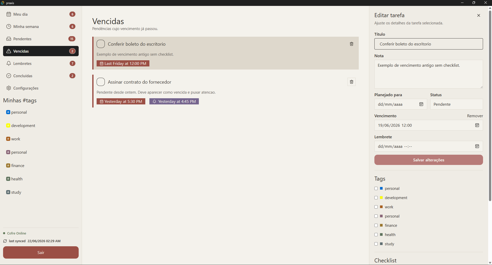

# Praxis

Praxis is a private desktop task manager built for one clear promise: create a task, remember it at the right time, and finish the day with nothing important forgotten.

Most task apps become project management systems. Praxis goes the other way. It is focused on daily execution, simple planning, reminders, pending counts, and a calm interface inspired by e-ink screens.



## Why Praxis exists

Praxis is for people who do not want a complex productivity ritual before doing the work.

The app is designed around a simple loop:

1. Capture what needs to be done.
2. Decide if it matters today, this week, or later.
3. Add a due date or reminder when needed.
4. Keep the pending count visible.
5. Complete tasks until the day is clear.

The badge, reminders, overdue views, and weekly planning are not decorative features. They exist to make pending work visible enough that it is hard to ignore, but calm enough that the app does not become another source of noise.

## Product philosophy

Praxis is guided by four principles:

- **Local first**: your task file is the source of truth.
- **Private by default**: the vault is encrypted before it is written to disk.
- **Daily clarity**: the most important view is what needs attention now.
- **Low friction**: create, update, complete, and move on.

Praxis is not trying to replace a full project management suite. It is a focused workspace for daily tasks, simple planning, reminders, and private personal execution.

## Screenshots

### Minha semana

Plan the next seven days starting tomorrow. Tasks stay grouped by day, completed tasks remain visible in context, and the badge counts only pending tasks in the visible week.



### Vencidas and task editor

Select a task to open a right-side editor with title, notes, status, due date, reminder, tags, checklist, and timeline.



### Lembretes

Reminders are grouped by urgency, including overdue reminders, today, tomorrow, this week, and later.


## Features

### Task management

- Create tasks with title and optional notes.
- Mark tasks as pending or completed.
- Keep completed tasks visible in contextual views such as Today and Week.
- Delete tasks when they are no longer useful.
- Sort tasks by practical urgency: overdue first, then nearest due date, then pending tasks without dates, then completed tasks.

### Today-first workflow

- **Meu dia** shows tasks planned for today, due today, overdue tasks, and completed work from the day.
- The app badge counts pending tasks that matter today.
- The goal is to make the daily pending count easy to see and easy to clear.

### Week planning

- **Minha semana** shows a seven-day window starting tomorrow.
- Each day has a compact calendar tile and task count.
- Clicking a day filters tasks for that specific date.
- Weekly badge counts only pending tasks inside the visible week.

### Reminders and notifications

- Tasks can have reminder date and time.
- Reminder tasks are listed separately.
- Native notifications can fire while the app is running in the background.
- The app can keep running in the tray after the user closes the window while the vault is open.

### Due dates and overdue state

- Tasks can have precise due date and time.
- Overdue tasks are separated into their own view.
- Overdue detection respects date and time, not only the day.

### Tags

- Tags can be assigned to tasks.
- Tags have colors for quick visual scanning.
- Tags are stored as entities, so future rename/color changes can reflect across tasks.

### Checklist inside tasks

- A task can contain checklist items.
- Checklist items are visual helpers, not separate scheduled tasks.
- The parent task exposes progress such as completed items and percentage.
- When all checklist items are completed, the parent task can be completed automatically.

### Lifecycle timeline

Praxis tracks meaningful events in the life of a task, such as:

- task created
- title or note updated
- due date changed or removed
- reminder changed or removed
- task completed
- task reopened
- tag added or removed
- checklist item added, renamed, completed, or reopened

This makes the task detail panel useful as a small history of what happened, not just a form.

### Badge and tray behavior

- The app can show a pending count in the taskbar icon.
- The badge is designed to represent work that still needs attention.
- When the vault is open, closing the window can minimize the app to the tray.
- When the vault is closed, closing the window exits the app.

### Private encrypted vault

Praxis stores data in a `.praxis` vault file.

- Data is local.
- The vault is encrypted.
- The user chooses where the vault file lives.
- The file can be placed in a sync folder such as Google Drive, OneDrive, Dropbox, or another provider.
- Praxis reads and writes from that file as the source of truth.

This model keeps the product simple: Praxis does not need a cloud account to be useful, and the user remains in control of the data file.

## E-ink inspired interface

Praxis uses a calm e-ink inspired visual direction:

- paper-like background
- soft ink text
- muted status colors
- high readability
- low visual noise
- desktop-first layout

The goal is to feel like a focused task instrument, not a colorful dashboard competing for attention.

## Tech stack

- **Tauri 2** for the desktop shell.
- **Rust** for local storage, vault handling, reminders, badge logic, and task commands.
- **Vue 3** for the interface.
- **Vite** for development and build.
- **TypeScript** for frontend safety.
- **Pinia** for application state.
- **Tailwind CSS 4** for styling.
- **Vitest** for frontend unit tests.

## Architecture

```text
src/
  app/          app bootstrap, router, layouts, shell, providers, global styles
  features/     product components grouped by feature context
  pages/        route-level screens composed from features/shared modules
  shared/       reusable libs, services, UI helpers, types
  stores/       Pinia stores for cross-feature state

src-tauri/
  src/
    app_config.rs          app preferences and health
    badge.rs               taskbar badge count
    checklist.rs           checklist item commands and parent progress
    lifecycle.rs           task timeline events
    native_reminders.rs    native reminder reconciliation
    recurrence.rs          recurring task rules
    reminders.rs           reminder scheduling state
    tags.rs                tags and task-tag relations
    tasks.rs               task commands, filters, sorting, views
    tray.rs                tray and close behavior
    vault.rs               encrypted .praxis file handling
```

## Task endpoints

The UI should not load everything and filter manually. Praxis exposes specific task views:

- `listTodayTasks()` brings all task statuses relevant to today.
- `listWeekTasks()` brings all task statuses for the visible week.
- `listPendingTasks()` brings only pending tasks.
- `listOverdueTasks()` brings only overdue pending tasks.
- `listUpcomingTasks()` brings pending future tasks.
- `listReminderTasks()` brings pending tasks with reminders.
- `listCompletedTasks()` brings completed tasks.

This keeps the frontend simple and keeps filtering rules centralized in the Rust backend.

## Getting started

### Requirements

- Node.js
- npm
- Rust
- Tauri prerequisites for your operating system
- On Windows: Visual Studio Build Tools with the C++ toolchain

### Install dependencies

```bash
npm install
```

### Run the frontend only

```bash
npm run dev
```

### Run the desktop app

```bash
npm run tauri dev
```

### Build frontend

```bash
npm run build
```

### Build desktop installer

```bash
npm run tauri build
```

### Run tests

```bash
npm run test:unit
cd src-tauri
cargo test
```

## Releases

The repository is prepared to publish Windows builds through GitHub Actions on pushes to `main`.

Users should be able to download the latest installer from the GitHub Releases page once a release workflow finishes successfully.

The app also includes updater support through Tauri's updater plugin.

## Documentation

Internal technical documentation lives in `docs/`:

- [Data model](docs/DATA_MODEL.md)
- [Task endpoints](docs/TASK_ENDPOINTS.md)
- [Storage architecture](docs/STORAGE_ARCHITECTURE.md)
- [Lifecycle event types](docs/LIFECYCLE_TYPES.md)
- [Technical decisions](docs/TECHNICAL_DECISIONS.md)
- [Memory strategy](docs/MEMORY_STRATEGY.md)
- [Quality audit](docs/QUALITY_AUDIT.md)

## Current status

Praxis is under active development.

The foundation already includes encrypted local storage, task views, reminders, badges, tray behavior, tags, checklist progress, lifecycle timeline, settings, and release plumbing.

The UI is still evolving. The current direction is intentionally calm, desktop-first, and e-ink inspired.

## What Praxis is not

Praxis is not a kanban board.
Praxis is not a team workspace.
Praxis is not a calendar replacement.
Praxis is not a productivity social network.

Praxis is a small private tool for remembering, planning, and finishing the work that matters.
